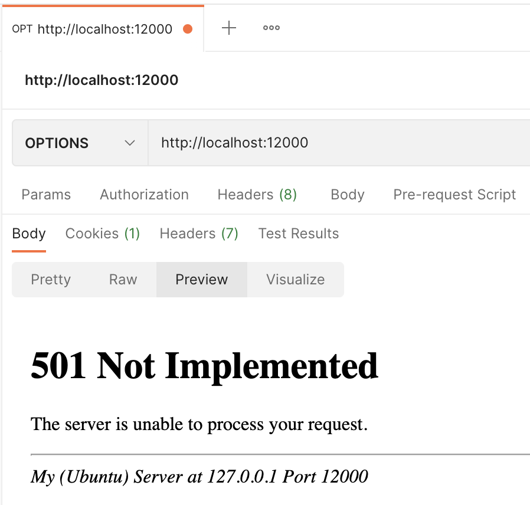

# HTTP_Server_Computer_Networks

## To Run the project:
1.  The main server file is  **https.py**
2. To run the server file: `python3 https.py 12000` (Any Port number can be given by user, we are assuming it to be 12000)
3. To run the automated testing file: `python3 testing.py 12000`
4. Configuration file of the server is  **conf.py**
5. Log file of server is  **access.log** and error logs are stored in **errors.log**  and will get updated as you make new requests.
6. Type 'quit' on server if you want to end the server program.

## Project Features:
1.  **HTTP Request Methods Implemented**: _GET, PUT, POST, DELETE, HEAD_
2.  **Implemented Status Codes**: _200, 201, 202, 204, 304, 400, 403, 404, 408, 411, 413, 414, 415, 510_
3.  **Configurations file**: For some server operations, a configuration file with Document Root was implemented.
4.  **Implemented Cookies and handled Persistent and non-Persistent connections**
5.  **Multithreading in server**: Implemented multithreading in server to run multiple requests simultaneously
6.  **Logging**: _INFO logs_ and _ERROR logs_ get stored for subsequesnt requests in **access.log** and **errors.log** respectively.
7.  **Automated Tests**: Implemented different tests using requests module and for sample website using webbrowser module
8.  **Implemented Cookies and handled Persistent and non-Persistent connections**

## Steps To Use: 

1. Once you run the server file, you can make multiple requests using browser or using _POSTMAN_.
2. To check on browser, you can:
      1. To view HTML file on browser, go to [http://127.0.0.1:12000/index.html](http://127.0.0.1:12000/index.html) 
      2. To view png image file on browser, go to [http://127.0.0.1:12000/pic.png](http://127.0.0.1:12000/pic.png) 
      3. To view jpg image file on browser, go to [http://127.0.0.1:12000/pic.jpg](http://127.0.0.1:12000/pic.jpg) 
      4. To view jpeg image file on browser, go to [http://127.0.0.1:12000/pic.jpeg](http://127.0.0.1:12000/pic.jpeg) 
      5. To view mp3 song file on browser, go to [http://127.0.0.1:12000/song.mp3](http://127.0.0.1:12000/song.mp3) 
      6. To view mp4 video file on browser, go to [http://127.0.0.1:12000/video.mp4](http://127.0.0.1:12000/video.mp4)
##
### Browser screenshots for different requests: 

##
### POSTMAN screenshots for requests with different status codes as responses:
404 Not Found| 408 Request Timeout
-----|------
 | 

413 Request Entity Too Large|501 Not Implemented
-----|------
 | 

DELETE Request|415 Unsupported Media Type
-----|------
 | 
